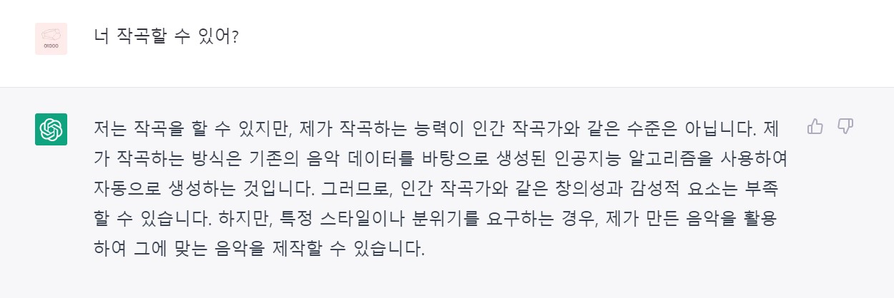
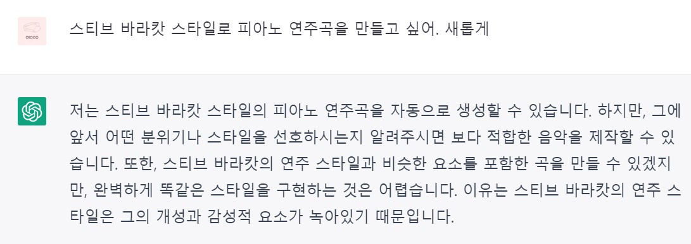
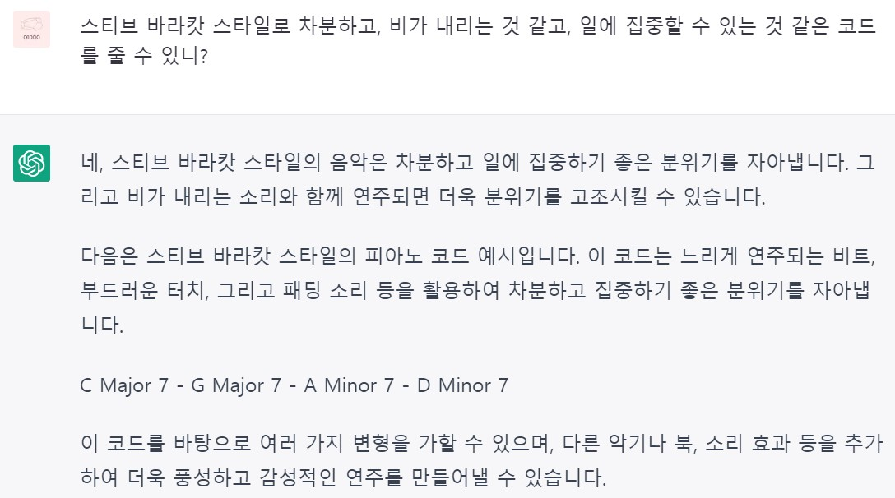
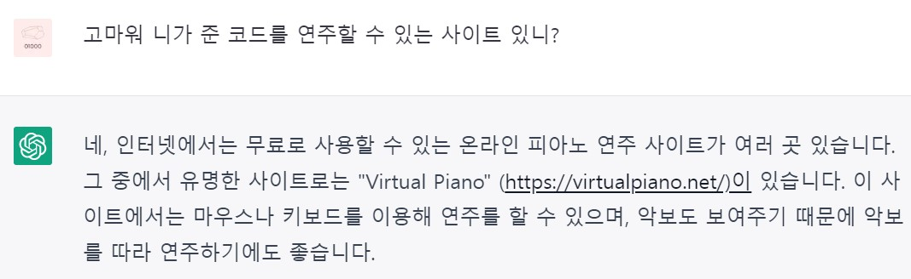

gpt에 접속합니다.

[https://chat.openai.com/chat](https://chat.openai.com/chat)

그리고 다음은 gpt와의 대화입니다.

[https://virtualpiano.net/](https://virtualpiano.net/)

사이트에 접속하여 사용법을 배웁니다. 

화음은 [ ]로 묶으며, 피아노 건반의 키로 연주 할 수 있습니다. 빈칸은 쉼표입니다. 이러한 규칙을 gpt에게 알려주었습니다. 그리고 코드를 생성해 달라고 하였습니다.

