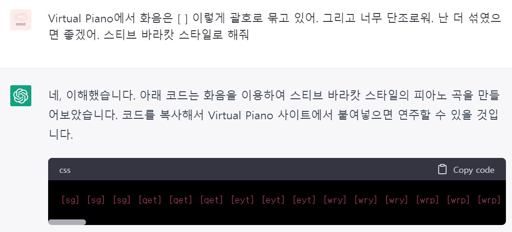
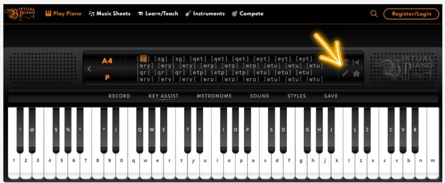

gpt에 접속합니다.

[https://chat.openai.com/chat](https://chat.openai.com/chat)

그리고 다음은 gpt와의 대화입니다.

[https://virtualpiano.net/](https://virtualpiano.net/)

사이트에 접속하여 사용법을 배웁니다. 

화음은 [ ]로 묶으며, 피아노 건반의 키로 연주 할 수 있습니다. 

빈칸은 쉼표입니다. 이러한 규칙을 gpt에게 알려주었습니다. 

그리고 코드를 생성해 달라고 하였습니다.

[sg] [sg] [sg] [qet] [qet] [qet] [eyt] [eyt] [eyt] [wry] [wry] [wry] [wrp] [wrp] [wrp] [wtu] [wtu] [wtu] [qr] [qr] [qr] [etp] [etp] [etp]

 [etu] [etu] [etu] [wry] [wry] [wry] [wrp] [wrp] [wrp] [wtu] [wtu] [wtu] [qey] [qey] [qey] [wtu] [wtu] [wtu] [eyo] [eyo] [eyo] [wtu] 

[wtu] [wtu] [qr] [qr] [qr] [etp] [etp] [etp] [etu] [etu] [etu] [wry] [wry] [wry] [wrp] [wrp] [wrp] [wtu] [wtu] [wtu] [qr] [qr] [qr] [etp]

 [etp] [etp] [etu] [etu] [etu] [wry] [wry] [wry] [wrp] [wrp] [wrp] [wtu] [wtu] [wtu] [qet] [qet] [qet] [eyt] [eyt] [eyt] [wry] [wry] [wry]

 [wrp] [wrp] [wrp] [wtu] [wtu] [wtu] [qr] [qr] [qr] [etp] [etp] [etp] [etu] [etu] [etu] [wry] [wry] [wry] [wrp] [wrp] [wrp] [wtu] [wtu]

 [wtu] [qr] [qr] [qr] [etp] [etp] [etp] [etu] [etu] [etu] [wry] [wry] [wry] [wrp] [wrp] [wrp] [wtu] [wtu] [wtu] [qey] [qey] [qey] [wtu] 

[wtu] [wtu] [eyo] [eyo] [eyo] [wtu] [wtu] [wtu] [qr] [qr] [qr] [etp] [etp] [etp] [etu] [etu] [etu] [wry] [wry] [wry] [wrp] [wrp] [wrp] 

[wtu] [wtu] [wtu] [qr] [qr] [qr] [etp] [etp] [etp] [etu] [etu] [etu] [wry] [wry] [wry] [wrp] [wrp] [wrp] [wtu] [wtu]

[https://youtu.be/6-TdX5xh39o](https://youtu.be/6-TdX5xh39o)

음악듣기 - 유튜브 영상

